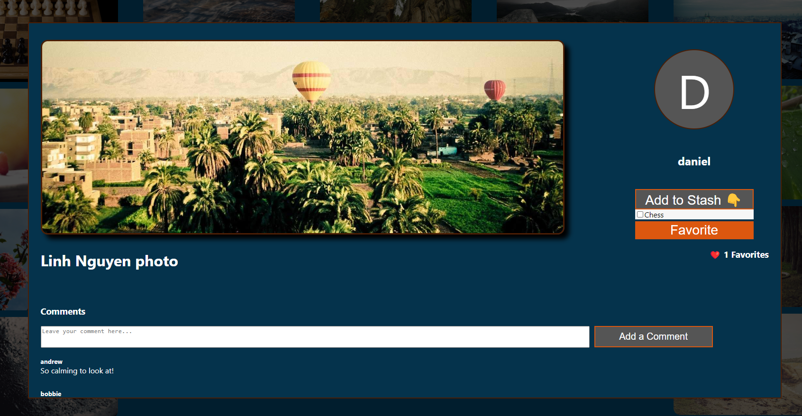

# Just Digital Stashes
_By [Sukhpreet Sidhu](https://github.com/sukhpreet-sidhu-AA), [Daniel Ho](https://github.com/dwho0937wei-dotcom), and [James Jones](https://github.com/James-Jon27)

## Introduction

Wlecome to **Just Digital Stashes**! This project aims to provide a user-friendly platform for stashing photos you make. Whether you're a professional photographer, a mom saving photos of her kid's achievements, or just someone who likes to see life from another perspective, Just Digital Stashes provides a intuitive interface for exploring this unique art form.

## Index
- [User Stories](https://github.com/James-Jon27/DJS/wiki/User-Stories)
- [MVP-List](https://github.com/James-Jon27/DJS/wiki/MVP-List)
- [Database Schema](https://github.com/James-Jon27/DJS/wiki/Database-Schema)
- [API Routes](https://github.com/James-Jon27/Just-Digital-Stashes/wiki/API-Routes)

## Technologies Used


- JavaScript
- React/Redux
- CSS
- HTML
- Python
- Flask/SQLAlchemy

## Overview

Just digital Stashes is a Pinterest clone, created to allow photograhers and others to react and save images they enjoy. Whena user first accesses the site they are bought to the home page where they will see 20  random images from across the site. 


When clicking on an image in the homepage a modal appears with all of that images information, such as the title, description, how many users have favorited the images, and the user who posted this image. Scrollin gon the modal will reveal user's comments for that post.

 

In the upper left hand corner of the page is a user interaction button where you can Log In or Sign up for the site. Both buttons open a modal with thier respective functionality.

 

When redirected and clicking on the user interaction button again you will see that it displays the user's username and email, with a log out button, that will log you out and take you back to a logged out home page.


Clicking on the username will take you to your posted images, and you may click on the abs to switch back and forth between your stashes or posted images. As a new user you may not have anything to view.


The difference between a logged in and logged out user is the Create tab that appears next to the search bar.


Now, as a logged in user you may open an image and see more features, such as the ability to post/delete a comment, favorite/unfavorite the image, and even add it to a stash.




If you are a new user, you may want to create a stash to start saving photos by clicking the create tab in  the upper right corner. you can also create an image from here.


Upon creating a stash you will be taken to that stashes page with otptions to delete or edit the stash. since its made empty, you will also see an option to go find some images to stash. Upon clicking that button you will be taken to the explore page.


Upon creating a new image, you will be taken to your "Posted Images" page where the image will appear among the top images. When opening your images, tou will be presented with an option to delete or edit that image.


## Getting started - 

1. Clone this repository (only this branch).

2. Install dependencies.

   ```bash
   pipenv install -r requirements.txt
   ```

3. Create a __.env__ file based on the example with proper settings for your
   development environment.

4. Make sure the SQLite3 database connection URL is in the __.env__ file.

5. This starter organizes all tables inside the `flask_schema` schema, defined
   by the `SCHEMA` environment variable.  Replace the value for
   `SCHEMA` with a unique name, **making sure you use the snake_case
   convention.**

6. Get into your pipenv, migrate your database, seed your database, and run your
   Flask app:

   ```bash
   pipenv shell
   ```

   ```bash
   flask db upgrade
   ```

   ```bash
   flask seed all
   ```

   ```bash
   flask run
   ```

7. The React frontend has no styling applied. Copy the __.css__ files from your
   Authenticate Me project into the corresponding locations in the
   __react-vite__ folder to give your project a unique look.

8. To run the React frontend in development, `cd` into the __react-vite__
   directory and run `npm i` to install dependencies. Next, run `npm run build`
   to create the `dist` folder. The starter has modified the `npm run build`
   command to include the `--watch` flag. This flag will rebuild the __dist__
   folder whenever you change your code, keeping the production version up to
   date.

## Deployment through Render.com

First, recall that Vite is a development dependency, so it will not be used in
production. This means that you must already have the __dist__ folder located in
the root of your __react-vite__ folder when you push to GitHub. This __dist__
folder contains your React code and all necessary dependencies minified and
bundled into a smaller footprint, ready to be served from your Python API.

Begin deployment by running `npm run build` in your __react-vite__ folder and
pushing any changes to GitHub.

Refer to your Render.com deployment articles for more detailed instructions
about getting started with [Render.com], creating a production database, and
deployment debugging tips.

From the Render [Dashboard], click on the "New +" button in the navigation bar,
and click on "Web Service" to create the application that will be deployed.

Select that you want to "Build and deploy from a Git repository" and click
"Next". On the next page, find the name of the application repo you want to
deploy and click the "Connect" button to the right of the name.

Now you need to fill out the form to configure your app. Most of the setup will
be handled by the __Dockerfile__, but you do need to fill in a few fields.

Start by giving your application a name.

Make sure the Region is set to the location closest to you, the Branch is set to
"main", and Runtime is set to "Docker". You can leave the Root Directory field
blank. (By default, Render will run commands from the root directory.)

Select "Free" as your Instance Type.

### Add environment variables

In the development environment, you have been securing your environment
variables in a __.env__ file, which has been removed from source control (i.e.,
the file is gitignored). In this step, you will need to input the keys and
values for the environment variables you need for production into the Render
GUI.

Add the following keys and values in the Render GUI form:

- SECRET_KEY (click "Generate" to generate a secure secret for production)
- FLASK_ENV production
- FLASK_APP app
- SCHEMA (your unique schema name, in snake_case)

In a new tab, navigate to your dashboard and click on your Postgres database
instance.

Add the following keys and values:

- DATABASE_URL (copy value from the **External Database URL** field)

**Note:** Add any other keys and values that may be present in your local
__.env__ file. As you work to further develop your project, you may need to add
more environment variables to your local __.env__ file. Make sure you add these
environment variables to the Render GUI as well for the next deployment.

### Deploy

Now you are finally ready to deploy! Click "Create Web Service" to deploy your
project. The deployment process will likely take about 10-15 minutes if
everything works as expected. You can monitor the logs to see your Dockerfile
commands being executed and any errors that occur.

When deployment is complete, open your deployed site and check to see that you
have successfully deployed your Flask application to Render! You can find the
URL for your site just below the name of the Web Service at the top of the page.

**Note:** By default, Render will set Auto-Deploy for your project to true. This
setting will cause Render to re-deploy your application every time you push to
main, always keeping it up to date.

[Render.com]: https://render.com/
[Dashboard]: https://dashboard.render.com/
